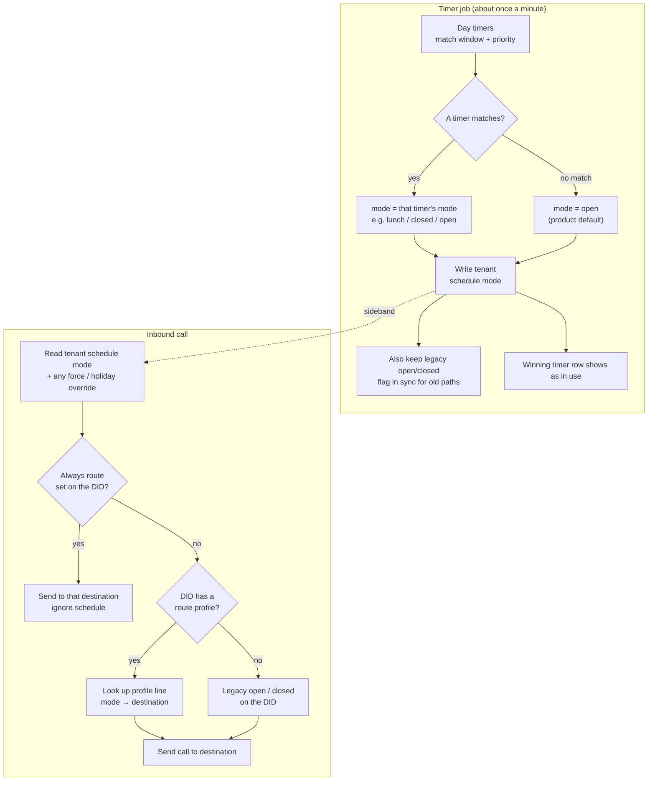

# Day timers and route profiles

How inbound schedule works in PBX3: **timers choose a period (mode)**; **route profiles choose a destination** for that mode. They are separate on purpose — mixing them up is the usual source of confusion.

This page is the operator model. Panel names: **Day Timers**, **Route Profiles**, **Inbound Routes**.

## Core idea

```text
Day timers / holidays / BLF force
        ↓
  tenant schedule mode   (e.g. open | lunch | closed)
        ↓
Inbound DID → route profile → line for that mode → destination
```

The timer routine does **not** set a route (IVR, extension, queue). It only writes the tenant’s current **mode**. The DID’s **route profile** maps that mode to a destination when the call arrives.

## Schematic



## What each piece does

| Piece | Sets | Does **not** set |
|-------|------|------------------|
| **Day timer** | Which **mode** this calendar window asserts (`closed`, `lunch`, …) | Destination / IVR / extension |
| **Timer job** | Tenant **schedule mode** (and legacy open/closed flag) | Which inbound destination to use |
| **Route profile** | Map **mode → destination** for one tenant | Clock / calendar |
| **Inbound DID** | Which profile (or Always route / Legacy open–closed) | Current mode |

## Modes

Modes are short lowercase labels (`open`, `closed`, `lunch`, …). Common ones are offered as suggestions; you can invent others (e.g. `evening`) if they match the allowed pattern.

**On-the-fly:** type a new mode in either **Day Timers** or **Route Profiles**. Suggestions include presets plus modes already used on that tenant (from profiles and day timers), so once you save `evening` on a profile it appears when editing a day timer — and the other way around.

**Rule:** the string on the day timer and the string on the profile line must be **identical**. A timer that asserts `lunch` only changes the call path if the DID’s profile has a **lunch** line.

If the profile has no line for the current mode, the call falls back to the profile’s **open** destination (then further legacy fallbacks). Do not rely on a separate “default mode” control in the UI — that knob is hidden on purpose.

## Default is open

When **no** day timer matches, the tenant mode is **`open`**. That is fixed for every tenant — there is no “default closed” baseline.

- Sites with **no timers** (only a BLF open/closed throw) stay open until forced closed.
- Office hours are usually painted as **closed** windows (overnight, weekends) on that open baseline — same polarity as classic SARK.

Coming from FreePBX or 3CX: those products often paint **open hours** and treat gaps as closed. Here, gaps stay **open** unless a timer (or force) says otherwise.

## Simple office example

Under default open:

1. Day timer: every day `17:00`–`09:00` → mode `closed` (overnight).
2. Day timers: Saturday and Sunday all day → mode `closed`.
3. Day timer: **Mon–Fri** `12:00`–`13:00` → mode `lunch` (one row — day range).
4. Route profile on the DID: `open` → main IVR, `closed` → night greeting, `lunch` → lunch queue.

Weekday mid-morning: no timer matches → **open** → main IVR. Noon → **lunch**. Evening → **closed**.

Day of week may be `*`, a single day, or a **forward** range (`mon-fri`, `mon-thu`, `tue-fri`, `sat-sun`). Wrap-around (`tue-mon`) is rejected.

## Related panels

- **Day Timers** — calendar windows and modes.
- **Route Profiles** — mode → destination maps (name them after migration; convert creates generic names).
- **Inbound Routes** — attach a profile to each DID; **Always route** skips the schedule entirely; **Legacy open / Legacy closed** are dual-read fallbacks when no profile applies.

## See also

- [Inbound routes (DDI)](inbound-routes.md)
- [Timers and class of service](timers-cos.md) — other timer/CoS topics (not day-parts)
