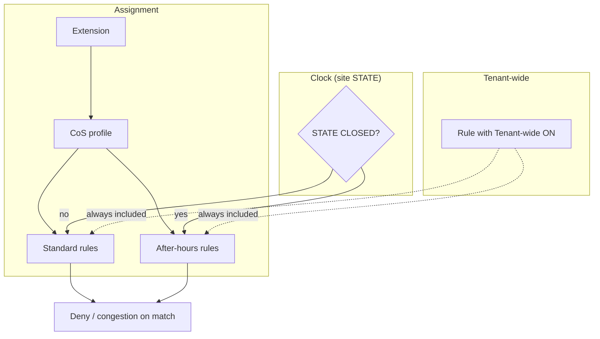

# Timers and class of service

## Day timers (schedule / day-parts)

For inbound open / closed / lunch-style routing, see **[Day timers and route profiles](day-timers-and-profiles.md)**. That is the operator help for calendar modes and profiles.

## Other timers

Edit system / feature timers as exposed → Save → **Commit**.

## Class of service (outbound deny)

CoS controls **what an extension may dial out**, not where inbound calls go. It is a **deny** layer: matched patterns congest / hang up. Feature codes, park retrieve, and emergency routes bypass CoS into the tenant dialplan.

Panels (Schedules & policy):

| Panel | Job |
|-------|-----|
| **CoS rules** | Deny-pattern packs (dialplan patterns, active, **Tenant-wide**) |
| **CoS profiles** | Named privilege packs: which rules apply in **Standard** vs **After-hours**; one **Default** profile per tenant |
| **Extensions** | Single **CoS profile** dropdown (not a per-phone rule matrix) |

Instance global **`cosstart`** (System globals): master on/off for CoS emission on Commit.

### Core idea

```text
CoS rule  = deny pack (patterns)
CoS profile = Standard list + After-hours list of rules
Extension → one profile
Tenant-wide (on a rule) = that rule applies to every profile for that side
```



### Default profile vs Tenant-wide

| Term | Means | Does **not** mean |
|------|--------|-------------------|
| **Default profile** | Fixed per-tenant profile **new extensions** get; **edit its lists** to change default policy (do not switch which profile is Default) | “Applies to every phone regardless of assignment” |
| **Tenant-wide** | A rule forced onto **all** profiles (Standard and/or After-hours) | “Default for new phones” |

High-risk seed rules (`HR_*`) typically sit on the default profile **and** have Tenant-wide ON so Unrestricted profiles cannot silently opt out.

### After-hours

After-hours lists are for **out-of-hours outbound throttle** (fraud / cost). When the site is **CLOSED** (including force closed), After-hours applies; otherwise Standard. Lunch and other inbound day-parts still use **Standard** dial rights unless you put stricter rules on After-hours only.

### Operator checklist

1. Create / edit **CoS rules** (patterns + Tenant-wide if needed).  
2. Edit the tenant **Default** profile’s lists (and/or create Staff / Lobby / Restricted as explicit classes).  
3. Assign profiles on **Extensions**.  
4. **Commit**.  
5. Prove: Staff ≠ Restricted dial; Tenant-wide ON Unrestricted still blocked for those rules; park / `*5` / emergency still work.

### Migrate from SARK

SARK per-phone CoS matrices become profiles via the same fingerprint convert used on existing pbx3 DBs. Operators may rename migrated profiles after import.

### Related

- Product lock: `COS_PROFILE_REQUIREMENTS.md` (in pbx3 workingdocs)  
- [Day timers and route profiles](day-timers-and-profiles.md) — inbound schedule (different job)  
- [Feature codes](feature-codes.md) — bypass CoS  
- [Instance globals](instance-globals.md) — `cosstart`
