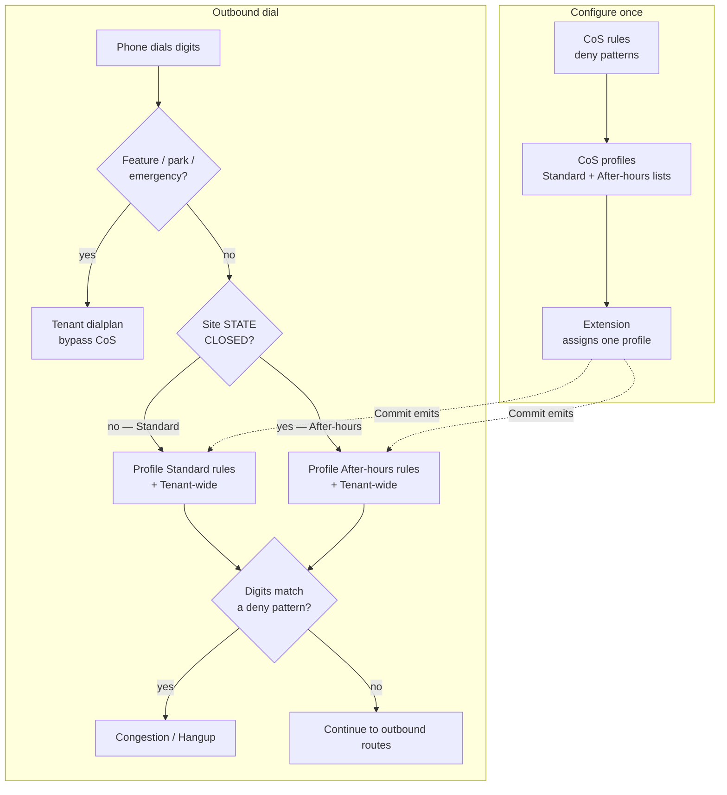

# Class of service (outbound deny)

CoS controls **what an extension may dial out**. It does **not** choose where inbound calls go (that is [day timers and route profiles](day-timers-and-profiles.md)).

Think of it as a **deny** layer: if the dialled number matches a rule’s patterns, the call is congested / hung up before it reaches an outbound route. Feature codes, park retrieve (`*5`, `901`–`903`), and emergency routes **bypass** CoS and go straight into the tenant dialplan.

Panels (sidebar → **Schedules & policy**):

| Panel | Job |
|-------|-----|
| **CoS rules** | Deny packs — dialplan patterns, active, optional **Tenant-wide** |
| **CoS profiles** | Named classes (Staff, Lobby, …) — which rules apply in **Standard** vs **After-hours** |
| **Extensions** | One **CoS profile** per phone (dropdown) |

Master switch: instance global **`cosstart`** ([Instance globals](instance-globals.md)). **OFF** → Commit skips CoS entirely.

---

## Core idea

```text
CoS rule     = deny pack (patterns → congestion)
CoS profile  = Standard list + After-hours list of rules
Extension    → exactly one profile
Tenant-wide  = this rule is forced onto every profile (for that side)
```

Operators think in **roles** (“Lobby cannot dial international”), not in a checkbox matrix per phone.

---

## How a call uses CoS



**After-hours** is for **out-of-hours outbound throttle** (fraud / cost) — e.g. allow international in business hours, block it overnight. Site **CLOSED** (including force closed) selects After-hours; otherwise Standard. Lunch and other **inbound** day-parts still use **Standard** dial rights unless you put stricter rules only on After-hours.

---

## Default profile vs Tenant-wide

These two labels are easy to mix up:

| Term | Means | Does **not** mean |
|------|--------|-------------------|
| **Default profile** | Fixed per-tenant profile that **new extensions** get. Change policy by **editing its rule lists** — you cannot re-point “which profile is Default” in the SPA | “Applies to every phone no matter what” |
| **Tenant-wide** (on a rule) | That rule is included on **all** profiles (Standard and/or After-hours) | “Default for new phones” |

Seeded high-risk rules (`HR_*`) usually sit on the Default profile **and** have Tenant-wide **ON**, so an “Unrestricted” profile cannot quietly opt out while Tenant-wide stays on. Clearing Tenant-wide (or deleting the rule) is intentional and must be obvious.

---

## Example shops

These are **illustrative** shapes — not shipped presets. Pattern syntax is Asterisk dialplan style (`_00.` = anything starting with `00`, etc.). Adjust for your numbering plan and OutRoutes.

### Small office — three roles

| Profile | Standard (open) | After-hours (closed) | Typical use |
|---------|-----------------|----------------------|-------------|
| **Default** | `HR_UK070`, `HR_OFFSHORE` (also Tenant-wide) | Same | New phones; floor for everyone |
| **Staff** | Default floor + `INTL` (`_00.`) | Default floor + `INTL` + `UK_MOBILE` (`_07.`) | Desks: international OK in hours; mobiles blocked overnight |
| **Lobby** | Default floor + `INTL` + `PREMIUM` (`_09.`) + national long-distance pack | Same as Standard (stricter all day) | Reception / waiting area |
| **Restricted** | Default floor + almost everything except local / emergency | Same | Demo phone, warehouse door |

Mental model: **Staff** can dial `_0044…` at 14:00; the same phone after force-closed cannot. **Lobby** never dials `_09…` regardless of clock.

### Tenant-wide floor only (Unrestricted opt-out)

| Piece | Setting |
|-------|---------|
| Rule `HR_UK070` | Patterns for UK `07` high-risk; **Tenant-wide ON** |
| Rule `PREMIUM_0900` | UK premium `09`; **Tenant-wide ON** |
| Profile **Unrestricted** | Empty Standard / After-hours lists in the UI |

While Tenant-wide is ON, Unrestricted still hits those rules. Turn Tenant-wide **OFF** (or remove the rule) if a profile must dial that pack.

### After-hours tighter than open

| Profile | Standard | After-hours |
|---------|----------|-------------|
| **Sales** | Local + national + mobile | Local + national only (no mobile / no intl) |
| **On-call** | Local + national + mobile + intl | Same as Standard (still reachable overnight) |

Same Default / Tenant-wide high-risk floor on both.

---

## Operator checklist

1. Create or edit **CoS rules** (patterns; Tenant-wide only when the rule must hit every profile).  
2. Edit the tenant **Default** profile lists; add Staff / Lobby / Restricted as named classes when roles differ.  
3. Assign a profile on each **Extension**.  
4. **Commit**.  
5. Prove: Staff ≠ Restricted; Tenant-wide ON still blocks Unrestricted for those rules; park / `*5` / emergency still work; force CLOSED flips After-hours.

---

## Migrate from SARK

SARK per-phone CoS matrices become profiles via fingerprint convert (same path as upgrading an existing pbx3 DB). Rename migrated profiles after import if the auto names are ugly. See the SARK migrate docs in **sark-to-pbx3**.

---

## Related

- [Day timers and route profiles](day-timers-and-profiles.md) — inbound schedule (different job)  
- [Feature codes](feature-codes.md) — bypass CoS  
- [Instance globals](instance-globals.md) — `cosstart`  
- Product lock (engineering): `COS_PROFILE_REQUIREMENTS.md` in pbx3 workingdocs  
- High-risk posture: `HIGH_RISK_DIAL_BLOCK_POSTURE.md` in pbx3 workingdocs  
