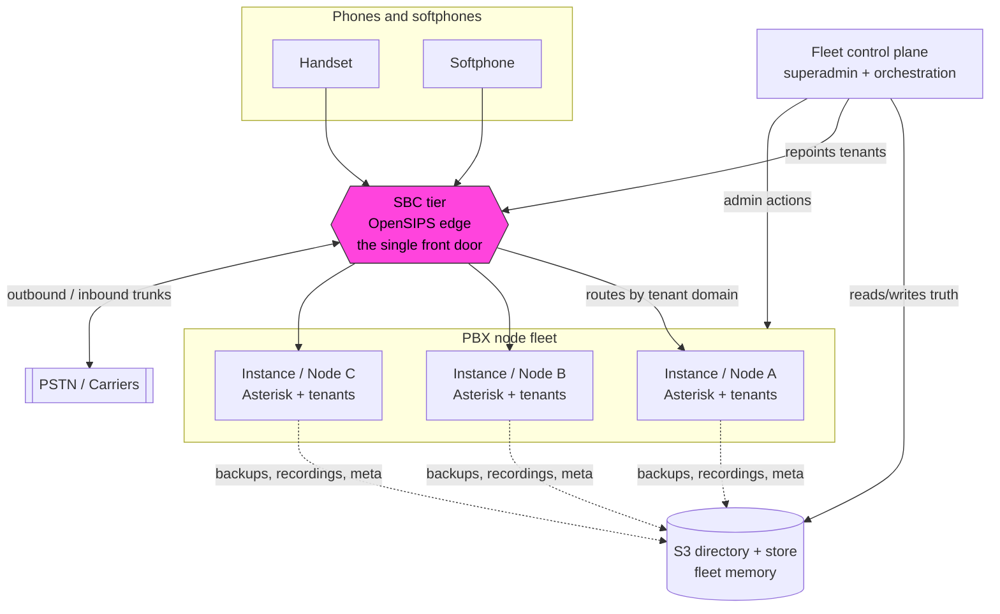
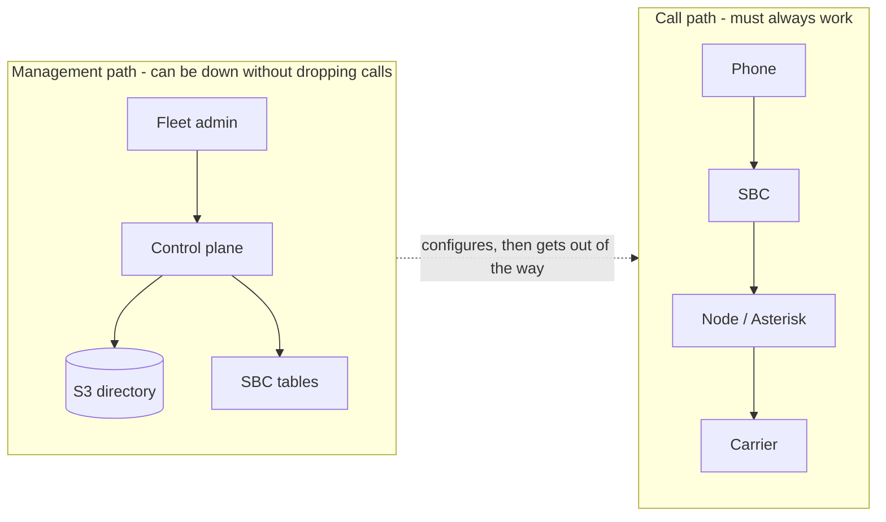
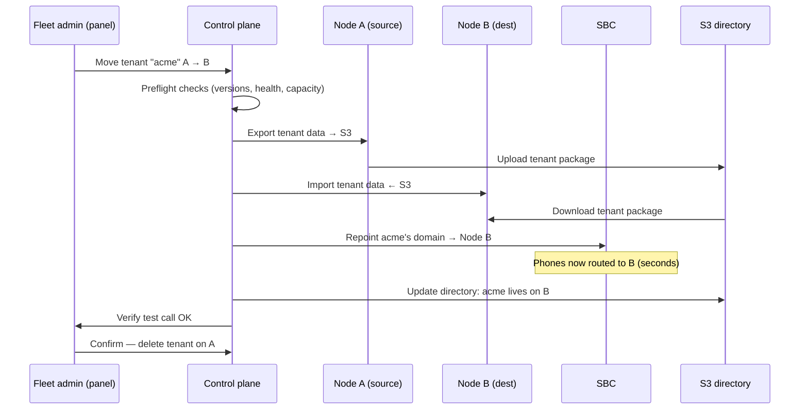
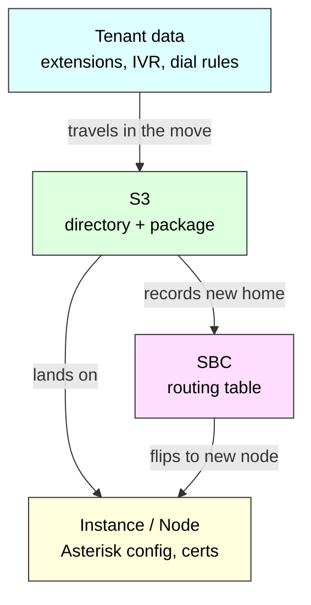

# What is PBX3?

**Audience:** anyone technical-ish who wants to understand *how the PBX3 fleet fits together* — product, ops, new engineers, interested stakeholders. Not a build spec.
**Reading time:** ~10 minutes.

---

## 1. The one-paragraph version

PBX3 is a **phone system built as a fleet** — many independent PBX nodes, not one big server. A customer phone system (a **tenant**) lives on one node at a time, but can be **moved between nodes** without changing anyone's phone, extension number, or dialling requirements.  An **SBC** (session border controller) sits in front of the fleet as the single door phones knock on, so moving a tenant is a routing-table change at the edge — not a DNS change or a phone reconfiguration. A shared **S3 store** holds the fleet's memory (who lives where, backups, recordings). Each part has one clear job, and — importantly — **calls keep working even if the management layers are down.**


---

## 2. The big picture



<details>
<summary>Same diagram as plain text (if the chart above shows as code)</summary>

```text
        Handset      Softphone
            \           /
             \         /
              v       v
        +-----------------------+        +====================+
        |        SBC tier       | <====> |   PSTN / Carriers  |
        |  (the single front    |        +====================+
        |   door for phones)    |
        +-----------------------+
           |        |        |
   routes by tenant domain   |
           v        v        v
      +--------+ +--------+ +--------+
      | Node A | | Node B | | Node C |     <-- PBX node fleet
      |Asterisk| |Asterisk| |Asterisk|         (identical, interchangeable)
      +--------+ +--------+ +--------+
           \        |        /
            \  backups, recordings, meta
             v      v      v
        +-------------------------+
        |   S3 directory + store  |  <-- fleet memory (who lives where)
        +-------------------------+
                   ^
                   | reads/writes truth, repoints tenants, admin actions
        +-------------------------+
        |  Fleet control plane    |  <-- superadmin + orchestration
        +-------------------------+
```

</details>

**How to read it:**
- **Phones** only ever talk to the **SBC**. They never need to know which node hosts their tenant.
- The **SBC** looks at the tenant's domain and forwards to whichever **node** currently hosts it.
- **Nodes** run the actual phone system (Asterisk) and the tenant data.
- **S3** is the shared filing cabinet — where each tenant lives, backups, recordings.
- The **control plane** is the management brain used by fleet admins; it changes routing and coordinates moves. **Calls do not depend on it.** Operators reach it via **Fleet mode** in the same admin SPA (not mixed with tenant panels on one screen) — see [Fleet overview](../fleet/overview.md).

---

## 3. The four functional areas

Each area has a **single responsibility** and a **blast radius** (what breaks if it misbehaves). Keeping these separate is the core discipline of the design.

| Area | One-line job | Owns | If it fails… |
|------|--------------|------|--------------|
| **Tenant** | A customer's phone setup | Extensions, IVRs, queues, dial rules, inbound-number behaviour | That one customer is affected |
| **Instance (Node)** | Runs the calls | Asterisk, local database, firewall, TLS certs, local admin | The tenants on that node are affected |
| **SBC** | The front door | Which node a tenant's phones/DIDs route to; edge security; carrier trunks | Routing to the fleet (calls in flight survive; new calls need the SBC) |
| **S3** | The fleet's memory | Directory (who lives where), backups, recordings, number inventory | Management/ops degrade; **calls keep running** |

### 3.1 Tenant — the customer

A **tenant** is (usually) one customer's phone world: their extensions, ring groups, IVR menus, voicemail, business hours, and their **outbound dialling policy** (what numbers they're allowed to call). Crucially, a tenant's identity is **decoupled from any physical server** — extension `2001` is `2001` no matter which node hosts it.  A customer who perhaps has more than one geographic location or business unit may have more than one tenant associated with it. 

Everything a tenant owns travels with it in a move. A tenant is *portable by design*.

### 3.2 Instance (Node) — the engine

An **instance** (or **node**) is a single PBX server — Asterisk plus its own database, firewall, and TLS certificates. Think of it like **one EC2 instance in an AWS account**: sovereign, self-contained, and responsible for its own security. It can host one or more tenants.

Nodes are **logically identical and interchangeable** — that's what makes moving tenants between them possible. A node keeps making calls whether or not the directory, control plane, or S3 are reachable.  Nodes may vary in size (CPU's, memory, disk) according to their anticipated workload.  

### 3.3 SBC — the front door

The **SBC** (built on OpenSIPS) is the single, stable address every phone talks to. Its job is deceptively simple: *"for this tenant's domain, which node should I send this to?"* It answers from a small routing table.

This one indirection is what makes the fleet flexible:
- **Phones never move.** They always point at the SBC.
- **Moving a tenant** = change one row in the SBC's table (tenant domain → new node). Seconds, reversible, no DNS wait.
- **Security concentrates** at the edge — scanners and bad actors hit the SBC, not every node.

**Standalone vs fleet authorship:** The same SBC product can front “any Asterisk” with its own admin UI (no directory required). A **PBX3 fleet** also drives that SBC from the **S3 directory** (who lives where, which numbers belong to whom) via the control plane — so fleet operators change intent in **Fleet mode** in the SPA, and the edge is updated as a projection. They should not also hand-edit those same fleet-owned rows on the SBC, or catalog and edge will drift. Facts not yet kept in the directory (for example many carrier trunk settings) can still be configured on the SBC.

Production fleets run **two or more identical SBCs** for redundancy — typically **active–passive behind one VIP** (signaling only / RTP bypass). A shared live routing database is **not** required; each member keeps a local store (**SQLite preferred** for single-file portability, with optional Litestream to S3; lab may still use MySQL).

### 3.4 S3 — the fleet's memory

**S3** is shared object storage that holds what no single node should own:
- **Directory / catalog** — the authoritative map of *which tenant lives on which node*.
- **Backups** — per-node and per-tenant.
- **Recordings** — call recordings, kept in one place across moves.
- **Number inventory** — which phone numbers belong to which tenant (fleet DID catalog; projected to the SBC).

S3 is **fleet infrastructure**, not owned by any node or tenant — so it gets its own security arrangements. A vital rule: **S3 is never in the call path.** It's the filing cabinet, consulted for management and recovery, never to connect a call.

---

## 4. The golden rule: calls never depend on management



<details>
<summary>Same diagram as plain text (if the chart above shows as code)</summary>

```text
  CALL PATH  (must always work)
  ----------------------------------------------------
     Phone --> SBC --> Node / Asterisk --> Carrier
  ----------------------------------------------------
                       ^
                       | configures, then gets out of the way
                       |
  MANAGEMENT PATH  (can be down without dropping calls)
  ----------------------------------------------------
     Fleet admin --> Control plane --> S3 directory
                            \--------> SBC tables
  ----------------------------------------------------
```

</details>

The **runtime path** (phone → SBC → node → carrier) is sacred. The **management path** (admin → control plane → S3/SBC) sets things up and then steps aside. If the control plane or S3 goes offline, you temporarily can't *move* a tenant or *change* the fleet — but **every existing tenant keeps making and taking calls.** This is the same principle as an EC2 instance running fine while the AWS console is unreachable.

---

## 5. What makes a tenant "portable" — a move, step by step

The headline feature: relocating a customer from a busy node to a quieter one, with no phone reconfiguration and near-zero downtime.



<details>
<summary>Same steps as plain text (if the chart above shows as code)</summary>

```text
  1. Admin           : "Move tenant acme from Node A to Node B"
  2. Control plane   : Preflight checks (versions, health, capacity)
  3. Node A  -> S3   : Export tenant data (upload package)
  4. S3 -> Node B    : Import tenant data (download package)
  5. Control plane   : Repoint acme's domain on the SBC -> Node B
                       (phones now routed to B, in seconds)
  6. Control plane   : Update S3 directory -> "acme lives on B"
  7. Admin           : Verify test call OK
  8. Admin           : Confirm -> delete tenant on Node A  (only now)
```

</details>

**What the customer notices:** essentially nothing. Phones re-register to the same SBC address; the SBC quietly sends them to the new node. In-progress calls finish on the old node; new calls land on the new one.

**Why it's safe:** every destructive step is gated. The tenant isn't removed from the source node until an admin confirms the move worked. Rollback (before that final delete) is a one-row flip back on the SBC.

---

## 6. Who does what during a move



<details>
<summary>Same diagram as plain text (if the chart above shows as code)</summary>

```text
   Tenant data                     travels in
   (extensions, IVR,   ----------- the move ----------->  S3
    dial rules)                                          (directory
                                                          + package)
                                                            |  |
                                              lands on <----/  \----> records
                                                 |                    new home
                                                 v                       |
                                        Instance / Node                  v
                                        (Asterisk config,  <---- flips  SBC
                                         certs)              to new    (routing
                                                             node       table)
```

</details>

| Question | Answer |
|----------|--------|
| Does the **tenant's config** move? | **Yes** — it's exported and imported. |
| Does the **phone** change? | **No** — it always points at the SBC. |
| Does **DNS** change? | **No** (SBC-fronted fleet) — the SBC handles it. |
| Does the **node** change? | It gains the tenant; nodes themselves don't move. |
| What **flips**? | The SBC's "tenant → node" row, and S3's record of where the tenant lives. |

---

## 7. Two deployment shapes

Not everyone needs the full fleet. The same software runs in two postures:

| | **Solo / trial** | **Fleet** |
|--|------------------|-----------|
| Nodes | One | Many, identical |
| SBC | Not required | **Required** (2+ for production) |
| S3 directory | Optional | Yes |
| Control plane | Not needed | Yes |
| Tenant moves | N/A | The headline feature |
| Who it's for | Kicking the tyres, small single-box installs | Growing / multi-customer deployments |

You can start solo and grow into a fleet; the node software is the same.

---

## 8. Glossary

| Term | Meaning |
|------|---------|
| **Tenant** | One customer's phone system (extensions, IVR, rules). Portable. |
| **Instance / Node** | One PBX server (Asterisk + local DB + firewall + certs). Hosts tenants. |
| **SBC** | Session Border Controller — the fleet's single front door for phones and carriers. |
| **S3 directory** | Shared store recording which tenant lives on which node, plus backups/recordings. |
| **Control plane** | The fleet management brain (superadmin, tenant moves, DID assign, edge project). Not in the call path. UI: **Fleet mode** in the admin SPA (separate API). Catalog is home of record; the SBC is a projection. |
| **DID / DDI** | A phone number that reaches a tenant from the outside world. |
| **Egress trunk** | The standard outbound pipe from a node to the SBC. |
| **Cutover** | The moment a tenant's traffic switches to the new node. |

---

## 9. Where to go next

| You want to… | Read |
|--------------|------|
| Try a single node | [Solo trial](solo-trial.md) |
| Fleet ops at a glance | [Fleet overview](../fleet/overview.md) |
| Move a tenant | [Tenant move](../fleet/tenant-move.md) |
| Onboard another instance | [Onboard a second instance](../fleet/onboard-instance.md) |
| Org bucket / catalog | [Cloud / S3 reference](../cloud/bucket-layout-cors.md) |
| Control host (Gatekeeper) | [Control host](../cloud/control-host.md) |
