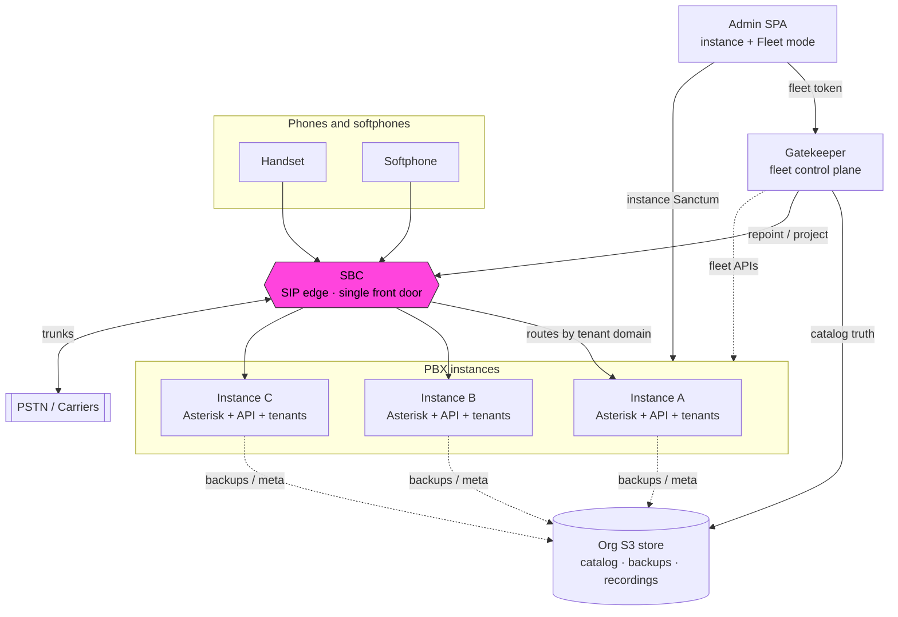

# What is PBX3?

PBX3 is a **phone system built for fleet operation**: many interchangeable instances (nodes), not one giant server. A **tenant** (customer) lives on one instance at a time, and can be moved without changing phones, extension numbers, or dial plans.

An **SBC** (session border controller) is the single front door for SIP. Moving a tenant is an edge routing change — not a DNS change on every handset. Shared **object storage** (S3 or compatible) holds fleet memory: who lives where, backups, recordings. The **Gatekeeper** is the fleet control plane operators use from **Fleet mode** in the same admin SPA.

## System schematic



<details>
<summary>Same diagram as plain text</summary>

```text
        Handset      Softphone
            \           /
             \         /
              v       v
        +-----------------------+        +====================+
        |          SBC          | <====> |   PSTN / Carriers  |
        |  (SIP front door)     |        +====================+
        +-----------------------+
           |        |        |
           v        v        v
      +--------+ +--------+ +--------+
      | Inst A | | Inst B | | Inst C |   PBX instances
      |Ast+API | |Ast+API | |Ast+API |
      +--------+ +--------+ +--------+
           \        |        /
            \  backups / catalog meta
             v      v      v
        +-------------------------+
        |     Org S3 store        |
        +-------------------------+
                   ^
                   | catalog / project / admin
        +-------------------------+     +------------------+
        |      Gatekeeper         | <-- | Admin SPA        |
        |   (fleet control)       |     | instance + Fleet |
        +-------------------------+     +------------------+
```

</details>

## How to read it

| Piece | Role |
|-------|------|
| **Phones** | Talk only to the SBC — they never need to know which instance hosts their tenant. |
| **SBC** | Looks at the tenant domain and forwards SIP to the right instance; peels carriers. |
| **Instances** | Asterisk + API + tenant data — the actual PBX. |
| **Org S3** | Shared filing cabinet: catalog, backups, recordings. Not on the call path. |
| **Gatekeeper** | Fleet control plane (catalog, moves, DIDs, users). Calls do not depend on it. |
| **Admin SPA** | One UI: instance admin (Sanctum) and Fleet mode (Gatekeeper token). |

## Solo vs fleet

- **Solo trial** — one instance, no org bucket or Gatekeeper required. See [Solo trial](solo-trial.md).
- **Fleet** — two or more instances sharing catalog + S3, with Gatekeeper and usually an SBC. See [Fleet overview](../fleet/overview.md) and [Cloud / S3 reference](../cloud/bucket-layout-cors.md).
