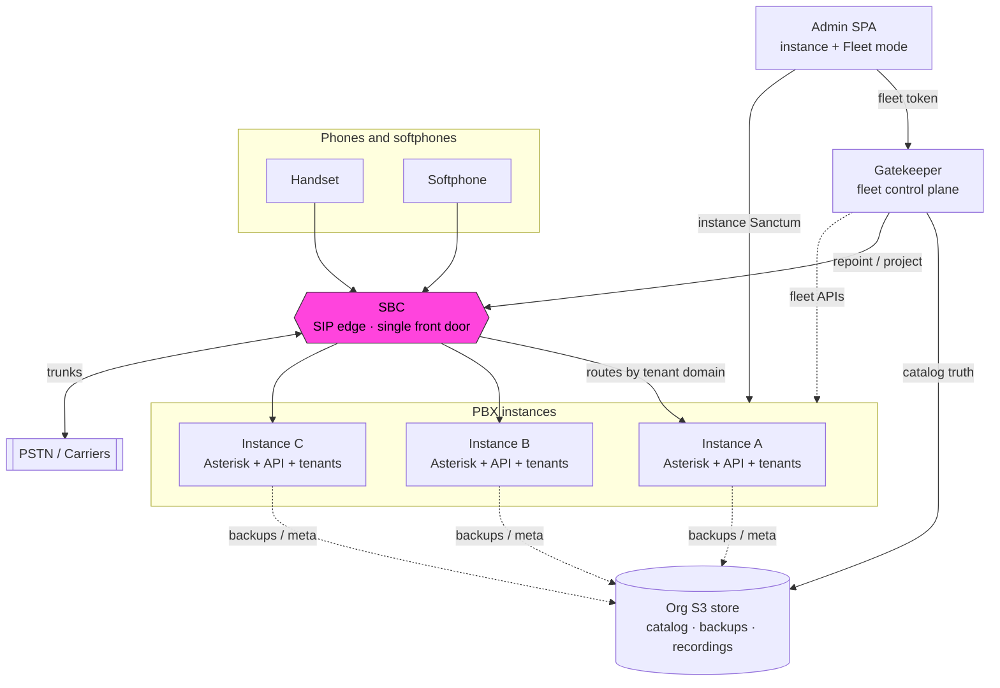

# PBX3 documentation

Operator and installer guides for **PBX3** — usable as the **lab runbook** while the product hardens (edit freely; treat drafts as living notes).

!!! tip "Lab map"
    Golden API `https://08jzwn.pbx3.com:44300/api` · Gatekeeper `https://control.pbx3.com` · SBC `https://sbc.pbx3.com/admin` · bucket `08jzwn-pbx3`

## Big picture

**Calls** go Phones → **SBC** → **instances**.   
**S3** and the **Gatekeeper** are control-plane memory and orchestration — calls keep working if they are down.

Start with [What is PBX3?](getting-started/what-is-pbx3.md), then [Sign in](getting-started/sign-in.md) or [Install](installation/requirements.md).
