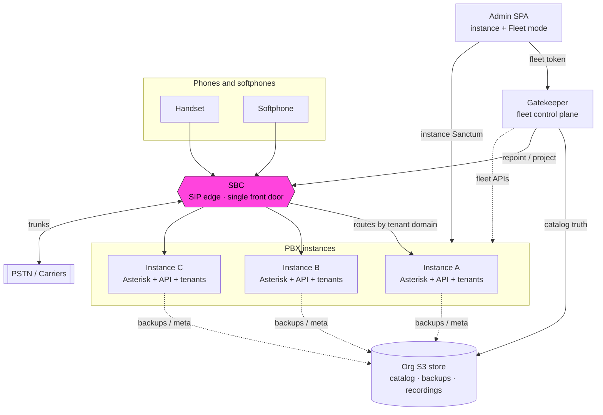

# PBX3 documentation

Operator and installer guides for **PBX3** — a multi-tenant phone system you can run as a single node or as a fleet.

!!! tip "Site status"
    Navigation and structure are live for review. Most pages are still placeholders; the system schematic below is the first real content.

## Big picture

**Calls** go Phones → **SBC** → **instances**. **S3** and the **Gatekeeper** are control-plane memory and orchestration — calls keep working if they are down.

Start with [What is PBX3?](getting-started/what-is-pbx3.md).
